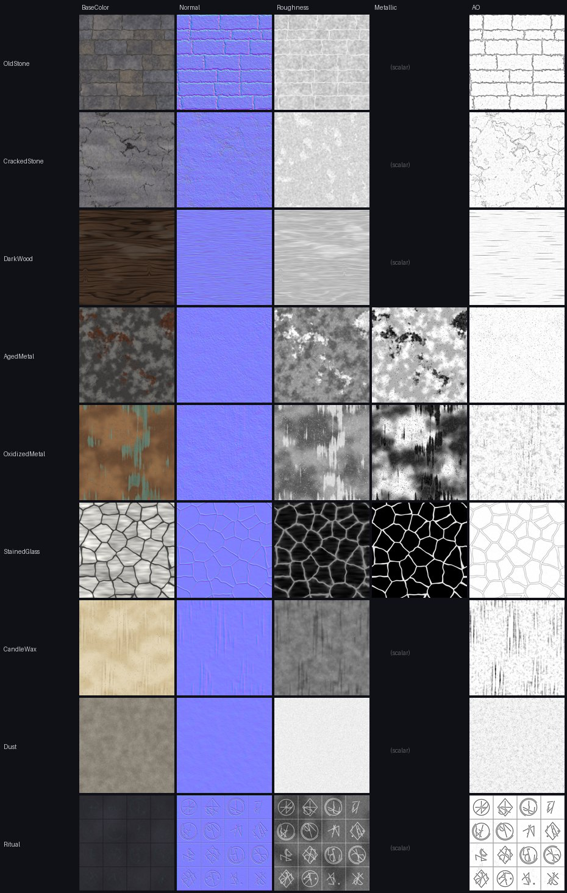

# Hollow Sanctum — PBR Material & Texture System

Material library for the arena (`Arena_RitualChamber` primitive assembly and the
`Arena_RitualChamber_MeshKit`). Built-in render pipeline, linear colour space,
Unity 2022.3. All textures, shaders and materials are original and generated
by scripts in `Tools/`, so they can be re-tuned and rebuilt at any time.

```
Tools/generate_arena_textures.py   # texture sets   (Tools/texgen/*)
Tools/generate_arena_materials.py  # master + variant materials (tables at top of file)
Tools/integrate_arena_materials.py # prefab wiring, reflection probe, OBJ importer metas
```

All three are safe to re-run: GUIDs already in `.meta` files are kept, so
nothing that references them breaks.

---

## 1. Structure: 9 masters, 25 variants

Unity **Material Variants** (`m_Parent`) hold the reuse. A master sets the
full surface (textures, projection, grime, dust, emission). A variant only
stores what it changes. Edit a master and every child follows. In a Player
build, variants are flattened.

| Master (`Materials/Arena/Masters/`) | Texture set | Variants (`Materials/Arena/`) |
|---|---|---|
| `M_Master_OldStone` | OldStone 1024² | `StoneWall`, `StonePillar`, `StoneTrim`, `StoneFloor` |
| `M_Master_CrackedStone` | CrackedStone 1024² | `Stone_Cracked`, `Statue_Eroded`, `Stone_Rubble` |
| `M_Master_DarkWood` | DarkWood 1024² | `Wood_Rotted`, `Door_Wood` |
| `M_Master_AgedMetal` | AgedMetal 512² | `Metal_Chain`, `Door_Iron` |
| `M_Master_OxidizedMetal` | OxidizedMetal 512² | `Brazier_Metal`, `Metal_Verdigris_Heavy` |
| `M_Master_StainedGlass` | StainedGlass 1024² | `Glass_Blue`, `Glass_Red`, `Glass_Amber` |
| `M_Master_CandleWax` | CandleWax 512² | `Candle_Wax`, `Candle_Wax_Ritual` |
| `M_Master_DustySurface` | Dust 512² | `Dust_Drift`, `Dust_Ash`, `Moss` |
| `M_Master_RitualSurface` | Ritual 1024² | `StoneFloor_Ritual`, `RitualMarking`, `RitualSigil`, `Ritual_Altar` |

These stay on Built-in `Standard` on purpose: `M_Arena_Candle_Flame` (pure
emissive), `M_Arena_Fog_Plane` (cheap transparent mist), `M_Arena_Banner_Cloth`.

Material names and GUIDs used before this work are unchanged, so every
existing prefab and scene reference still resolves.

## 2. Texture sets



Folder: `Assets/Art/Textures/Environment/Arena/<Set>/T_<Set>_<Map>.png`

| Map | Import | Notes |
|---|---|---|
| `BaseColor` | sRGB, Default | Albedo stays in a physically plausible range: stone 0.13–0.30 linear, no baked lighting |
| `Normal` | Normal map | OpenGL (+Y), built from the same height field as AO and roughness |
| `Roughness` | Linear, single channel | Real roughness, not smoothness. The shader converts it |
| `Metallic` | Linear, single channel | Metal and glass sets only (glass: lead came mask). Non-metal sets use the scalar |
| `AO` | Linear, single channel | Cavity/crevice occlusion at material scale |

- **Sizes:** 1024² for large surfaces, 512² for props and metal, 256² for the
  shared macro map. That is 43 PNGs, about 20 MB on disk; GPU memory with DXT/BC
  compression is much lower. Nothing is larger than 1024.
- **Tiling:** every map tiles seamlessly (periodic noise, wrapped cells).
- **Emission masks:** `T_Ritual_Emission` (fine veins),
  `T_Ritual_Sigil_Emission` (circular seal, UV-mapped on the centre disc),
  `T_Ritual_GlyphStrip_Emission` (glyph band for the floor plates). All glyphs
  are invented shapes.
- **`Shared/T_Arena_MacroVariation`**: R = large blotches, G = mottling,
  B = vertical streaks. Every master samples it at 5–12 m so the 1–3 m detail
  tiling never shows a visible repeat.

## 3. Shaders

`Assets/Art/Shaders/Environment/`

### `Vespershade/Environment/Lit` (opaque, all non-glass masters)
Surface shader on Standard lighting (PBR GGX, shadows, lightmaps, reflection
probes, fog, instancing).

- **Projection:** world-space triplanar by default, so walls, floors and pillars
  line up across modules with no UV seams and a consistent texel density
  (`_TileSize` = metres per repeat). Props (wood, metal, wax) set
  `_ObjectSpace = 1` so the texture moves with the object. `_UV_MAPPING` switches
  to mesh UV0.
- **Anti-repetition (layered):**
  1. macro variation map at a large scale → albedo and roughness drift
  2. per-object tone and hue shift from the object's world position
     (`_ObjectVariation`), so twin pillars never match exactly
  3. object-space props get a per-object projection offset, so repeated
     props don't sample the same patch of texture
- **Grime:** a damp darker band at the base of walls (`_GrimeHeight`,
  `_GrimeStrength`), plus leak streaks from macro B (`_StreakStrength`).
- **Dust layer:** gathers on up-facing surfaces and in cavities (AO-biased), with
  its own albedo and normal. A swept radius (`_DustCenter`, `_DustRadius`) keeps
  the combat disc cleaner than the edge of the room, as if feet have scuffed it.
- **Emission:** `_EmissionMap` × HDR `_EmissionColor` × a slow flow along the
  veins × `(1 + _RitualPulse)`. `ArenaLightingController` drives `_RitualPulse`
  through one shared MaterialPropertyBlock, so no material instances are created.
- **Wax translucency:** wrap and back-light scatter for candle bodies
  (`_TRANSLUCENCY`).

### `Vespershade/Environment/StainedGlass` (transparent)
Premultiplied-alpha surface shader (`alpha:premul`, so specular stays bright on
dim glass) with a palette key in BaseColor alpha: primary, secondary and accent
glass from one texture. Lead came, from the metallic mask, is metallic and fully
opaque. The glass does not cast shadows (transparent queue). Moonlight transmission is faked as emission, and grime darkens
the edges. Colour variants only change three palette colours.

## 4. Where materials go

`integrate_arena_materials.py` assigns materials by object name:

| Objects | Material |
|---|---|
| Damaged pillars, ruined arches, sealed door | `Stone_Cracked` |
| Rubble fragments, rubble piles, debris, ruined statue | `Stone_Rubble` |
| Window frames and tracery, stair treads, wall bases and cornices | `StoneTrim` |
| Gargoyles, statues | `Statue_Eroded` |
| Centre seal, inner runes | `RitualSigil` (UV-mapped sigil, bright) |
| Dais tiers, edge ring | `StoneFloor_Ritual` (faint veins) |
| Floor plates around the dais | `RitualMarking` (glyph strip, telegraph-bright) |
| Altar slab | `Ritual_Altar` |
| Candles on or near the dais (r < 9.5 m) | `Candle_Wax_Ritual` (darker, cyan-stained) |
| Iron gate, brackets | `Door_Iron` · braziers on the dais → `Metal_Verdigris_Heavy` |
| Moss patches · banners | `Moss` · `Banner_Cloth` |

**Reflection probe:** `ReflectionProbe_Sanctum` in both assemblies. It is
realtime, renders once on Awake, 128 px, HDR, with a 42×18×42 box projection.
Metal, wax and polished basalt reflect the candle-lit room instead of the void,
without needing a bake.

## 5. Primitive assembly fixes (made while integrating)

Real textures exposed a few geometry problems in `Arena_RitualChamber.prefab`:

- Walls, pillars and floors used the built-in **Quad** mesh (`10210`) even though
  they had 3D scales and BoxColliders. Faces rendered as flat cards. They now use
  **Cube** (`10202`).
- BoxCollider sizes were multiplied by the transform scale twice (a wall
  collider was 31×256 m). They are now in mesh space.
- The 16 wall segments (5.6 m wide on a 7.5 m chord) left 1.9 m gaps. They are
  now 7.7 m wide, so the ring is closed.
- Window frames, glass and shards sat *inside* the wall volume. They now sit
  just in front of the inner wall face.
- Ritual floor plates at r = 7 were half buried in the edge of the 14 m dais
  tier. They moved to r = 8.2.

## 6. OBJ mesh kit import

`Assets/Models/Arena/*.obj` now have `ModelImporter` metas. The meshes are
pinned to fileID `4300000` through `internalIDToNameTable`, which matches the
MeshKit prefab references. Material import is off, and materials come from the
prefabs. UVs are metric (1 unit = 1 m), so `_UV_MAPPING` materials tile correctly.

## 7. Tuning cheatsheet

| Want | Change |
|---|---|
| Whole room darker or lighter | master `_Color` (all variants follow) |
| Texture looks too big or small | variant `_TileSize` (metres) |
| Visible repetition | raise `_MacroAlbedo` (0.12→0.2) or lower `_MacroScale` |
| Twin props look identical | raise `_ObjectVariation` |
| More neglect | `_DustAmount`, `_GrimeStrength`, `_StreakStrength` |
| Ritual stronger at telegraph time | `ArenaLightingController.ritualPulseStrength`, or script `_RitualPulse` |
| New material | add a row to `VARIANT_DEFS` in `generate_arena_materials.py`, then run it |
