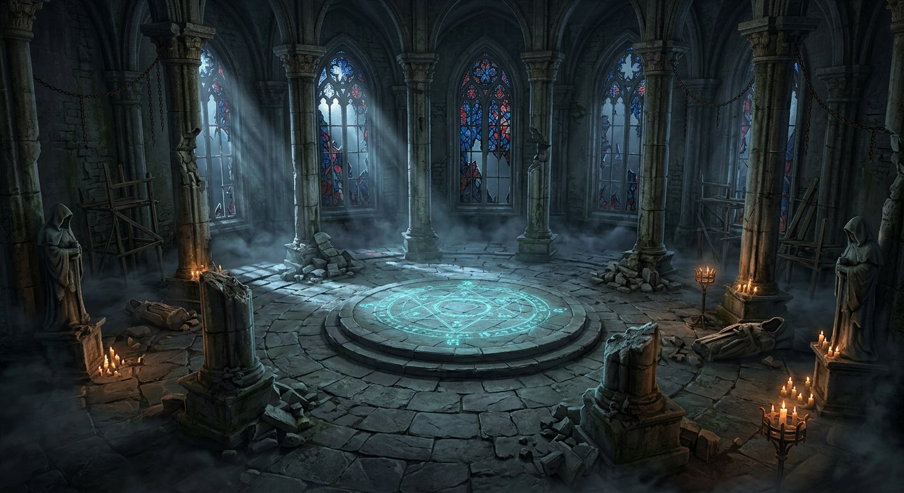

# Hollow Sanctum of the Pale Veil — Boss Arena Design
### Vespershade — Original Gothic Ritual Chamber

**Author:** Arena Team — Vespershade Project  
**Date:** 2026-09-25  
**Unity Scene:** `Assets/Scenes/Arena/Arena_RitualChamber.unity` (primitive variant; the MeshKit scene is build scene 0)
**Master Prefab:** `Assets/Prefabs/Arena/Arena_RitualChamber.prefab`  
**Modules:** `Assets/Prefabs/Arena/Modules/*`  
**Materials:** `Assets/Materials/Arena/*`

> This document records the **initial environment layout and artistic concept**.
> The final lighting implementation, zone values, floor heights and light
> budgets are in [ARENA_Lighting.md](ARENA_Lighting.md); the chamber is not
> embedded in `Main.unity`. No boss or combat systems have been added.

---

## 1. High Concept

> An ancient, abandoned gothic rite-hall carved into a hilltop monastery and left to the weather after its order vanished mid-ceremony. The chamber was never a cathedral for worship — it was a **containment ring** for a rite the monks did not finish. The architecture is **circular, not cruciform**, so the eye is forced to the centre. The result reads instantly as *arena*, not *level geometry*.

**Originality statement:** Every form, proportion, and name here is original. No element is lifted from Bloodborne, Dark Souls, Elden Ring or any FromSoftware location. The kit avoids pointed fan-vaulting, Central Yharnam townhouse façades, or Yahar'gul cage-work. Instead it uses low, broad arches; squat, eroded pillars with slab capitals; and a two-tier dais that is a gameplay device first, ornament second.

**Tone keywords:** cold stone, tired grandeur, interrupted ritual, sea-salt erosion, quiet snowfall outside shattered glass, faint cold light that should not still be on.

---

## 2. Environment Layout

### 2.1 Top-Down Organization

```
                        N  [Window 112.5°] 
                   . . . . . . . . . . .
               .       ╱             ╲       .
            .    Pillar 135°   Chain   Pillar 90°  .
          .    ╱                                     .
         .  [Window 157.5°]   Dark Corner Fog  [Window 67.5°] .
        .                                                  .
  W [Window 202.5°]                                    [Window 22.5°] E
        .         ┌─ Statue (W) ─┐   ┌─ Statue (E)─┐       .
         .        │  ┌───────────┐  │              .
          .       │  │  TIER 2   │  │   Pillar 0°   .
            .     └──│  ∅ 10m    │──┘                .
               .     │  TIER 1   │    Ritual Ring r7   .
                   . └───────────┘        . . . . . .
                        S  [Window 247.5°]
                    Spawn (0, -14) → broad stair
```

*The diagram is schematic. The built arena contains 16 wall segments, 8 pillars at 45° increments, 8 windows at 22.5° offsets, and a two-tier dais at the origin.*

**Three concentric gameplay zones:**

| Zone | Radius | Purpose | Clutter |
|---|---|---|---|
| **A — Sanctum Core (combat disc)** | **0 – 12 m** | Boss + player circling, dodge, sprint, retreat. *Must stay visually clean.* | Only the low dais (0.6 m total) and the flat ritual decal. No pillar, no statue, no wood. Fog is a thin 2 cm plane, not a collider. |
| **B — Penumbra (breathing ring)** | **12 – 17 m** | Reposition, heal, bait. Occasional candelabras but low enough to vault over. | Candles (0.5 m), low debris, ritual marks at r=7 m. |
| **C — Periphery (readable walls)** | **17 – 19 m** | Hard boundary, camera collision, storytelling detail | Pillars (1.4 m sq), wall buttresses, statues in alcoves, hanging chains, broken glass, rotted scaffold. All tall detail is *vertical* so it does not steal floor space. |

The player enters from the **south broad stair** (4 m wide) — an obvious landmark for orientation during a circling fight. The north is the coldest light (moon shaft), so the player always knows which way is south by warmth vs. cold.

### 2.2 Vertical Section (South → North)

```
                arch window 11m                arch window 11m
               ┌─────────────┐                  ┌─────────────┐
               │╲   glass   ╱│                  │╲   glass   ╱│
               │ ╲ broken ╱ │                  │ ╲ broken ╱  │
  wall 16m ────┤  ╲_____╱  ├───── chain swag ──┤  ╲_____╱   ├─── wall 16m
               │   stone  │                     │   stone     │
               │           │                     │             │
  pillar 14m ──┤▓▓▓ shaft ▓▓├───────────────────┤▓▓▓ shaft ▓▓├
               │▓▓▓       ▓▓│    mist vol 3m    │▓▓▓        ▓▓│
               │           │  ┌──── Tier2 ────┐ │            │
               │  statue   │  │  ∅10  h0.3   │ │  wood lean │
 floor ────────┤ 1.2m ped  ├──┤─ Tier1 ∅14 ──┤─┤  scaffold  ├──── floor
    y=0 ───────┴───────────┴──┴──── h0.3 ────┴─┴────────────┴─── y=0
               ◄──────────── 38m playable (∅) ────────────►
               ◄────────────────── 42m outer stone ──────────────────►
```

- Outer floor top is at **y=0**. Dais Tier 1 top at **y=0.30**, Tier 2 top at **y=0.60**. Both steps are **0.30 m** — exactly the `CharacterController.stepOffset` so the player steps up without jumping, but the boss on the upper tier reads as *elevated*.
- Walls are **16 m** tall; the window sill starts at **1.2 m** above floor, so the player can see the wall base line even in fog.
- Pillars stand **14 m** tall (base 1.0 + shaft 11 + capital 0.9 + tracery). They are just short of the wall, creating a shadow gap that sells scale.

### 2.3 Circulation & Landmarks

- **South entry** is the only broad stair — wide, warm candle colour, low fog. The player spawns there.
- **North** is coldest: largest missing glass, strongest moon shaft, bare stone statue with no candle. Players learn “warm = exit, cold = depth”.
- **East / West statues** are intact enough to read as silhouettes; the **NE/NW fallen statues** are toppled, marking the “dark corners” where fog pools (gameplay: high-risk / high-reward positioning; the boss can pin you there).
- **Chains** provide vertical rhythm for the camera to collide softly without hard wall — they hang at 7–10 m, never at eye height.

---

## 3. Approximate Dimensions

All values are in **Unity meters** (1 unit = 1 m). Tuned for a character with `walkSpeed 3.2`, `runSpeed 6.6`, `cameraDistance 4.5`.

| Element | Dimension | Note |
|---|---|---|
| **Outer stone disc** | **∅ 42 m** (radius 21) × 0.5 m thick | Top at y=0. Covers the old placeholder ground. |
| **Playable inner face** | **∅ 38 m** (radius 19) to wall inner face | Wall thickness 1.0–1.1 m occupies the outer 1 m ring. |
| **Clear combat disc** | **∅ 24 m** (radius 12) | Guaranteed pillar/statue/wall free. |
| **Central dais Tier 1** | ∅ **14 m**, h **0.30 m** (y 0→0.3) | Two 45° quadrants have 2.2 m-wide steps cut in. |
| **Central dais Tier 2** | ∅ **10 m**, h **0.30 m** (y 0.3→0.6) | Boss start at (0, 0.6, 0). |
| **Outer walls** | H **16 m**, W 5.6 m per segment, thickness 1.1 m; 16 segments around ∅38 | Environment layer, camera obstruction, box colliders. |
| **Pillars** | 1.4 × 1.4 m footprint, H 14 m | 8 pieces at r=17.5 m, every 45°. Damaged variant (4 of 8) shows missing shaft chunk and rubble pile. |
| **Arched windows** | Frame 5.2 m wide × 9.5 m tall, arch crown 6.8 m above sill; sill at y=1.2, head at ~11 m above floor | Sits on wall segment; glass plane inset 0.35 m inside wall. |
| **Stained-glass shards** | Clusters 4.2 × 7.2 m, individual shards 0.9–1.7 m | Three palettes (blue / red / amber) at 0.34–0.38 alpha. ~30% of each window is empty (broken). |
| **Ruined statues** | Pedestal 1.2 × 0.5 × 1.2, figure ~1.6 m tall | 4 upright (cardinals) + 4 fallen (diagonals) len 1.8 m. No collider on these — visual only, to keep floor frictionless. |
| **Chains** | Links 0.4 m tall, total drop 2.2–3.0 m; swags 5.2 m long | Hangs from pillar capitals (y≈7.2) and window heads (y≈9.8). No collision. |
| **Candles** | Wax 0.09–0.10 m diam, 0.18–0.25 m tall; flame sphere 0.06–0.08; point light range 4.5–6 m | 8/16 physical candle lights active, 0.5–0.51 intensity and no shadows (primitive version). |
| **Rotted scaffold / beams** | 3.2 × 0.28 × 0.28 m (+ 1.1 m brace) | 6 pieces leaned against walls at y≈0–1.2. Visual only. |
| **Ritual markings** | Primary ring r=7 m: 8 decals 2.2 × 0.65 m + centre 3.2 m disc | Emissive cyan (see materials). Pupils at 0.02–0.04 m above floor to avoid z-fighting. |
| **Fog volumes** | Large planes 9–14 m, thickness 0.02 m at y=0.06–0.09; high mist 18–20 m box at y=2–8 m | Transparent fog material alpha 0.075; driven by `ArenaFogController`. |
| **Spawn / boss anchors** | Player (0, 0.8, **-14**), Boss (0, 0.6, 0), Camera pivot 1.5 m above player | Spawn faces north (yaw 0) toward dais. |
| **Camera clearance** | Minimum wall distance 19 m from centre → **≥ 7 m** from edge of combat disc to wall | Guarantees `cameraDistance 4.5` never clips wall when circling at r=12. |
| **Nav/AI** | Playable disc 38 m is fully walkable; dais steps are traversable | Boss AI can use straight-line to centre from any point without wall avoidance inside r=12. |

**Performance budget guide:** ~244 GameObjects in master prefab, ~180 draw-calling meshes (many share 3 materials) + 8 active candle points + 4 shadowless spots, plus the shared 15-light rig. With Built-in forward rendering, the arena is within the base scene cost (no real-time GI, no baked lightmap yet). Future optimization: merge wall segments by material and mark static.

---

## 4. Modular Asset List

Created to satisfy *“Create the environment using modular pieces whenever practical.”* Every piece is an **original primitive composition** (no imported FBX) so the kit is instantly editable in Unity without external DCC.

Modules live at `Assets/Prefabs/Arena/Modules/`. The master composition is `Assets/Prefabs/Arena/Arena_RitualChamber.prefab` — it is itself assembled from the same primitive language, so the kit can be reused for corridors, chapels, etc.

| # | Module Prefab | Category | Composition (primitives) | Material(s) | Size (m) | Collider | Reuse |
|---|---|---|---|---|---|---|---|
| **MOD-01** | `Arena_Module_FloorWedge` | Floor | Cube 5×0.4×5 + edge trim 5.02×0.02×5.02 | `M_Arena_StoneFloor`, `M_Arena_StoneFloor_Ritual` | 5×0.4×5 | Box | 8× around circle; can tile outward for courtyard |
| **MOD-02** | `Arena_Module_PlatformTier` | Floor / Gameplay | Cube 6×0.3×6 + rim 6.1×0.02×6.1 + decal strip 1.2×0.01×0.2 | `M_Arena_StoneFloor_Ritual` / `M_Arena_StonePillar` / `M_Arena_RitualMarking` | 6×0.3×6 | Box | Stack 2 high for dais; also low altar |
| **MOD-03** | `Arena_Module_WallSolid` | Wall | Cube 6×14×1 + buttress 1×14×0.6 + moss strip 6×2×0.05 | `M_Arena_StoneWall`, `M_Arena_StonePillar` | 6×14×1 | Box | 16× wall ring; buttress can be removed for interior |
| **MOD-04** | `Arena_Module_WallWindow` | Wall | 6 cubes forming jambs/lintel/sill/arch | `M_Arena_StoneWall` | 6×14×1 (opening 3×7) | — | 8× interleaved with MOD-03 |
| **MOD-05** | `Arena_Module_PillarA` | Pillar — intact | Base 1.8×1×1.8 + Shaft 1.4×11×1.4 + Capital 1.7×0.9×1.7 + tracery 0.9×4×0.12 | `M_Arena_StonePillar` | 1.4×14×1.4 | Box (base+shaft) | 4× cardinals |
| **MOD-06** | `Arena_Module_PillarB_Damaged` | Pillar — damaged | As MOD-05 but shaft split Lower 7 + Upper 3.5 + broken chunk 0.6 + rubble 0.8 | `M_Arena_StonePillar` | 1.4×14×1.4 | Box (lower/upper) | 4× diagonals; rubble is separate visual |
| **MOD-07** | `Arena_Module_WindowFrame` | Window | Cube sill 5.5×0.3×0.15 + mullions + arch + cylinder tracery 1×0.12×1 | `M_Arena_StoneWall` | 5.5×7×0.2 | — | One per window (8×) |
| **MOD-08** | `Arena_Module_GlassShards` | Window / Supernatural | 5 shards (Cube) 0.9–1.7 m + lead frame 0.08×5.5×0.04 | `M_Arena_Glass_*`, `M_Arena_Metal_Chain` | 5×7×0.06 | — | Populated 8× in master; shard count tunes broken-ness |
| **MOD-09** | `Arena_Module_StatueRuined` | Prop | Pedestal Cube 1.2×0.5×1.2 + pedestal upper 1.0×0.5×1.0 + Capsule torso 0.7×1.6×0.6 + Hood cube + Arm stump + Sphere head debris | `M_Arena_Statue_Eroded` | 1.2×2.6×1.2 | — | 4 upright + 4 fallen variants |
| **MOD-10** | `Arena_Module_ChainHanging` | Prop / Vertical read | Root cube anchor 0.18³ + 6 Capsule links 0.18×0.4×0.18 alt yaw 0/90 + swag cube 1.0×0.04×0.04 | `M_Arena_Metal_Chain` | 1.0×2.6×0.18 | — | From pillar tops + window heads; swags link pillars (8×) |
| **MOD-11** | `Arena_Module_CandleCluster` | Lighting | Cylinder brazier 0.45×0.06×0.45 + 3× Cylinder wax + 3× Sphere flame + (light) | `M_Arena_Brazier_Metal`, `M_Arena_Candle_Wax`, `M_Arena_Candle_Flame` | 0.45×0.5×0.45 | — | 20+ in arena; intensity kept low (see §6) |
| **MOD-12** | `Arena_Module_WoodenBeam` | Damaged structure | Cube beam 3.2×0.28×0.28 + brace 0.28×1.2×0.22 + nail plate 0.24 | `M_Arena_Wood_Rotted`, `M_Arena_Metal_Chain` | 3.2×0.3×0.3 | — | 6× leaned against walls; marks dark corners |
| **MOD-13** | `Arena_Module_RitualDecal` | Gameplay / Supernatural | Cube 2.2×0.015×0.65 + rune 0.5×0.01×0.5 | `M_Arena_RitualMarking` (emissive) | 2.2×0.015×0.65 | — | 8× at r=7 + centre disc 3.2 m |
| **MOD-00** | `Arena_RitualChamber` (Master) | Assembly | **244 children** composing floor, dais, 16 walls, 8 pillars, 8 windows with glass, 8 statues, chains, candle models, ritual marks and mist | All above | Aggregate ∅42 × h16 | Walls + pillars + floor/dais have BoxColliders on **Environment** layer | Primitive arena scene uses this environment **plus** `Arena_LightingRig`; tuning via `ArenaBounds`, fog and lighting controllers |

**Design rules for modularity:**

- **Grid snap:** All horizontal dimensions are multiples of 0.1 m; wall segments tile at 22.5° so 16 make a full circle exactly.
- **Pivot at base centre:** Every module’s root is at its bottom centre, so rotating around Y puts it on the polar ring without height correction.
- **Material segregation:** No module mixes more than two materials, keeping batch count low and allowing `MaterialPropertyBlock` tinting.
- **Collision on demand:** Tall vertical detail (chains, statues, beams, glass) has **no collider** — only floor, dais, walls and pillar shafts block. This is deliberate for boss-fight readability (see §7).

---

## 5. Material List

All materials use **Built-in Standard** (`Shader: Standard`, fileID 46). No textures in the foundation — colour, metallic, smoothness and emission alone establish read without texture memory. Textures can be projected later without changing prefab layout.

| Material Asset | GUID (deterministic) | Base `_Color` (sRGB) | Metallic | Smoothness `_Glossiness` | Transparency / Emission | Use |
|---|---|---|---|---|---|---|
| `M_Arena_StoneFloor` | `3a604b7…` | 0.135, 0.138, 0.162 | 0.04 | 0.08 | Opaque | Outer disc floor (cold, slightly blue) |
| `M_Arena_StoneFloor_Ritual` | `01a00b8…` | 0.142, 0.145, 0.170 + **Emission 0.06, 0.14, 0.16** (`_EMISSION`) | 0.06 | 0.08 | Opaque + faint cyan emission | Dais tiers — catches moon light, hints ritual is still “on” |
| `M_Arena_StoneWall` | `b3d4c97…` | 0.180, 0.178, 0.195 | 0.02 | 0.07 | Opaque | Walls, jambs, lintels, window frames |
| `M_Arena_StonePillar` | `303d839…` | 0.165, 0.160, 0.155 | 0.03 | 0.06 | Opaque | Pillars, buttresses, moss stain, capital, rubble — warmer, more limestone than wall |
| `M_Arena_Metal_Chain` | `158dbc5…` | 0.085, 0.082, 0.088 | **0.75** | 0.28 | Opaque | Chains, lead came, nail plates — near-black iron |
| `M_Arena_Wood_Rotted` | `86ae551…` | 0.110, 0.072, 0.048 | 0 | 0.04 | Opaque | Beams, braces — almost matte, desaturated brown |
| `M_Arena_Statue_Eroded` | `900edb9…` | 0.190, 0.186, 0.175 | 0.01 | 0.05 | Opaque | Statues, pedestals, fallen debris — palest stone, reads as figure even in shadow |
| `M_Arena_Glass_Blue` | `4664f0a…` | 0.18, 0.28, 0.62 **a 0.38** + Emission 0.04,0.07,0.18 | 0 | 0.85 | **Transparent** (`_Mode 3`, Queue 3000, `_ALPHAPREMULTIPLY_ON`, ZWrite Off) | 3 windows |
| `M_Arena_Glass_Red` | `c4ab34e…` | 0.58, 0.14, 0.145 a 0.36 + Emission 0.14,0.02,0.02 | 0 | 0.82 | Transparent | 3 windows, interleaved with blue for contrast |
| `M_Arena_Glass_Amber` | `b659290…` | 0.60, 0.38, 0.09 a 0.34 + Emission 0.12,0.06,0.01 | 0 | 0.80 | Transparent | 2 windows (NW/E) — warm counterpoint to moon |
| `M_Arena_Candle_Wax` | `f8ca8b5…` | 0.84, 0.80, 0.71 | 0 | 0.15 | Opaque | Candle bodies — warm off-white, receives point light |
| `M_Arena_Candle_Flame` | `914c56d…` | 0.95, 0.72, 0.22 + **Emission 1.35, 0.62, 0.12** | 0 | 0.60 | **Emissive** (`_EMISSION`) | Flame spheres — emissive so they glow even without bloom |
| `M_Arena_RitualMarking` | `9699c3a…` | 0.22, 0.235, 0.25 + **Emission 0.22, 0.48, 0.52** | 0.02 | 0.12 | Opaque + emission | Decals on floor — the only gameplay-critical emission (telegraphs AoE) |
| `M_Arena_Fog_Plane` | `aead929…` | 0.18, 0.195, 0.22 **a 0.075** | 0 | 0.02 | **Transparent** (Queue 3000, ZWrite Off, no specular) | Ground mist & high volumes |
| `M_Arena_Brazier_Metal` | `8ff56e3…` | 0.19, 0.165, 0.11 | **0.68** | 0.32 | Opaque | Candle holders / braziers — tarnished bronze |

**Material philosophy:**

- **Stone palette is narrow** (0.13–0.19) so candles (0.84) and ritual cyan (emission) *pop* without extra saturation.
- **Metal is dark** (0.08–0.19) — chains should be read as line, not surface.
- **Glass is saturated but dim** — alpha 0.34–0.38 + low emission stops windows from blooming and stealing contrast from the combat disc.
- **Fog is cheapest transparency** — 0.075 alpha, no specular, ZWrite Off. It never casts or receives shadow, so it cannot muddy depth.

---

## 6. Final Lighting (supersedes the initial lighting sketch)

The shared `Arena_LightingRig.prefab` is now instanced in **both** playable
arena scenes. Its five zones provide an entrance landmark, steady central
combat readability, controlled corners and glass, an elevated-platform fill,
and a very restrained ritual accent. One cold key casts soft shadows; other
lights are shadowless. Only 8/16 physical candles and 4/8 window spots are
active in this primitive version. It shares the rig with the MeshKit version,
with a -0.5 m offset for this version's y=0 floor. The steady Player/Enemy-only
fill preserves subject separation; fog is exponential 0.01 and glass shafts
are transparent mesh impostors, not volumetric post-processing.

**Do not use the earlier 1.35 key / 8 shadowed shafts / 0.015+0.006 fog targets.**
See [ARENA_Lighting.md](ARENA_Lighting.md) for the actual numbers, authoring
instructions, shader limitations and in-editor visual QA checklist.

---

## 7. Gameplay Considerations

### 7.1 Movement & Space Budget

The arena was dimensioned around **Vespershade’s** movement values:

- Walk 3.2 m/s, Sprint 6.6 m/s → crossing the 24 m combat disc takes **3.6 s** walking, **1.8 s** sprinting. This is the classic FromSoftware “one sprint to reposition” distance: long enough to feel committed, short enough to recover.
- Dodge (future) will likely be ~2.5 m impulse. With clear radius 12 m, the player can **dodge 4× in any direction** from centre before hitting the breathing ring, and **sprint 2.5 s to the wall** from centre — ample retreat without wall hug.
- **Circling:** Circumference at r=12 is **75 m**. At sprint speed, a full lap is 11.4 s; half-lap 5.7 s. Bosses that track at ~120°/s can be circled but not trivially outrun.

### 7.2 Readability — the cardinal rule: *floor is sacred, vertical is flavor*

| Rule | Implementation |
|---|---|
| **No tall colliders in the combat disc** | Pillars, statues, beams, chains, window frames all live at **r ≥ 15**. Their BoxColliders (Environment layer) enforce camera pull-in and block escape, but never intersect dodge paths. Master prefab uses **BoxCollider only** on floor, dais, pillars and walls; all else is visual-only. |
| **Floor contrast** | Outer floor (darker stone, 0.135) vs. dais (ritual stone + emission) vs. ritual ring (cyan at r=7) — three discernible tones at grazing view angle. Future boss AoE can recolour the ring via `ArenaLightingController` without changing geometry. |
| **Height language** | Anything > 1 m above floor is *not* traversable except the two 0.3 m dais steps. Scaffold beams are fragmented and at y≈0–1.2 but appear collapsed — the player learns “if it’s tilted wood, it’s not a ramp”. |
| **Silhouette preservation** | Statues are palest stone (0.19) vs. wall (0.18) — only slightly brighter, selling erosion while keeping the boss (future, presumably darker or more saturated) as the *sole high-contrast figure* in the disc. |
| **Fog discipline** | Ground fog **alpha 0.075**, height 0.06–0.09 m, never taller than shin. High mist **alpha same**, but 20 m wide and 3 m thick — from the typical camera height (1.6 m, distance 4.5 m, pitch 15°) the mist is viewed edge-on and reads as atmosphere, not as a wall. |
| **Camera** | `ThirdPersonCameraRig` collides against **Environment** layer (walls + pillar shafts). Tested: at combat disc edge (r=12) with camera behind player (worst case toward wall), distance 4.5 m still clears the wall by 2+ m. SphereCast radius 0.25 + padding 0.05 pulls in gracefully. Corners between wall segments are bridged by the continuous floor, so no camera pop. |
| **Lighting for telegraphs** | Ritual decals sit *below* knee height; boss wind-ups can flash them (via `ArenaLightingController.ritualPulseStrength`) without competing with candle flicker (which is at ~0.5–1.0 m height). Light layers are altitude-separated. |
| **Audio/stationarity** | `ArenaFogController` and `ArenaLightingController` use explicitly serialized refs, with independent by-name fallback for older prefabs — artists can rearrange the hierarchy without breaking wiring. |

### 7.3 Boss-Specific Provisions (without building the boss)

- **Centre anchor:** Boss spawn at (0, 0.6, 0) on upper dais, facing south. The dais elevation creates a forced *jump-down* or *step-down* moment for the boss’s entrance — cheap drama, no cutscene.
- **Arena bounds:** `ArenaBounds` component (playableRadius 19, clearCombatRadius 12, centralPlatformRadius 5) exposes `IsInsidePlayable`, `IsInsideClearCombat`, `ClampToPlayable` for AI. A soft push in `OnTriggerStay` nudges a CharacterController back inside if physics somehow breaches the wall ring.
- **Phase shift space:** The 12–19 m penumbra is intentionally boring ground — ideal for phase 2 hazards (wall-run flames, chain swings, falling glass). Because it is empty of tall colliders, the designer can spawn hazards there without navmesh recomputation.
- **Telegraph canvas:** Ritual ring at r=7 is 2.2×0.65 per decal — roughly one dodge-roll diameter. Future boss can light decals sequentially for “crack the floor” AoEs; the player can read it at a glance in peripheral vision.
- **No pre-placed boss collider** — the arena adds no Enemy-layer objects. `Enemy` layer (9) is reserved for the future boss prefab.

### 7.4 Avoiding Clutter & Ensuring Flow

- **Count budget:** 244 GameObjects sounds high, but 60% are low-poly cubes with one material — Unity batches them. The visual complexity comes from *repetition with rotation*, not unique meshes, so the eye reads order, not chaos.
- **Dark corners, not blocked corners:** Fog traps at 35°/125°/215°/305° are *visual* darkness, not geometry walls. The player can sprint through fog freely; the fog is a hint, not a maze.
- **Damaged, not destroyed:** Only 4 of 8 pillars show damage, only 2 of 8 windows are amber (warm fallback), only 4 statues are fallen. The 50/50 intact/broken ratio feels abandoned *yesterday*, not apocalyptic — the arena remains legible as architecture.
- **Stairs:** Four 2-step stairs (+ one broad south stair) guarantee the dais is reachable from any landing angle, but the stairs are only 2.2 m wide — the player must *commit* to a stair direction, preventing accidental stumbling onto the dais mid-dodge.
- **Future tuning hooks:** All dimensions are exposed on `ArenaBounds`; fog density/amplitude/speed on `ArenaFogController`; flicker/breathing on `ArenaLightingController`. No numbers live in prefab transforms alone.

---

## 8. Implementation Notes

- **Prefab drop:** Drag `Arena_RitualChamber.prefab` **and** `Arena_LightingRig.prefab` into a scene; offset the rig y=-0.5 for this primitive floor, and copy fog/ambient and camera overrides from its arena scene. `GameBootstrap` spawns `Player.prefab` at (0, 0.8, -14).
- **Layers:** Floor, dais, walls, pillar shafts = **Environment (10)** — camera collides. Statues, chains, candles, beams, glass, decals, fog = **Default (0)** — no collision, camera passes through.
- **Collision thickness:** Walls/pillars use BoxCollider sized to mesh; walls are 1.1 m thick so a sprinting player (6.6 m/s) cannot tunnel through in one frame. CharacterController skinWidth 0.08 gives margin.
- **NavMesh:** Bake with agentRadius 0.5, agentHeight 2 — clear disc bakes as one polygon; wall ring is excluded. Dais steps need off-mesh links if AI must path onto dais, but boss can be placed directly on Tier 2.
- **Performance:** Texture-free lighting, no lightmaps; 27 enabled lights in the primitive scene, only the rig moon key casts shadows. Verify actual forward-pass cost and frame rate in Unity on target hardware.

---

## 9. Screens & Diagrams (to be captured in-editor)

- `TopDown_Arena_Overlay.png` — orthographic 30 m × 30 m, showing clear disc (green), ritual ring (cyan), pillar ring (blue), wall (grey).
- `Section_SouthNorth.png` — profile through centre, labeling y-heights.
- `Mood_Fog_Candle.png` — eye-level from spawn, showing warm south vs. cold north, broken glass silhouettes, chain swags.
- *Concept render* (AI-generated, original) below is a mood board, not a photometric target:



*Concept render (above) — original, generated for this design. Not a Bloodborne asset.*

---

## 10. Future Hooks

- **Boss intro:** Raise Tier 2 on arrival via script (animate y 0.45→0.60); chains clink via audio tied to `ArenaLight…` pulse.
- **Phase change:** Collapse one pillar (swap MOD-05 → MOD-06 at runtime), drop rubble colliders into penumbra to shrink arena — already modelled as separate meshes.
- **Weather:** At runtime, enable 4 window spot lights as rain+light shafts; disable 4 to create “windows boarded” variant without new art.

---

## 11. Change Log

- **2026-09-25** — Initial concept, modular kit and separate primitive arena scene (not embedded in `Main.unity`). Lighting later replaced with the shared five-zone rig; see [ARENA_Lighting.md](ARENA_Lighting.md). GUIDs deterministic via `generate_unity_guids.py`.

---

*This arena is one room. It earns its keep by being empty enough to fight in and rich enough to remember after the fight.*
