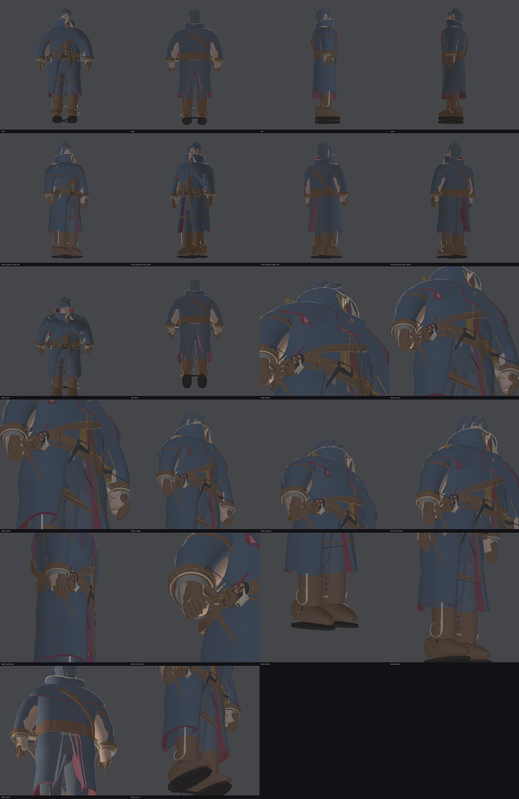

# Protagonist clothing — layered gothic outfit

Design and verification notes for the Veilbound Wayfarer's clothing, an original
outfit authored from scratch for Vespershade. **Nothing here is derived from
Bloodborne or any other game** — the silhouette, motifs, hardware and names below
were invented for this project, and the only inputs are the protagonist's own
body/head mesh, the existing character palette and the shipped Player prefab.



## What changed

Only the protagonist's clothing. The head, face, hair, gloves' hands, boots' feet,
the rig, the prefab hierarchy, the CharacterController and every gameplay script
are untouched — the mesh simply grew a full wardrobe around the same body.

| | before | after |
| --- | --- | --- |
| triangles | 39 232 | 62 504 (clothing adds 42 840) |
| submeshes | 9 | 11 (`+Linen`, `+Iron`) |
| garments | flat ring/tube primitives | 39 shells with rims + 39 linings, 295 named parts |

## Layer stack

Layers are stacked with real, measured gaps in metres, and every layer's surface
is an explicit table in `Tools/character_clothing.py`, so nothing interpenetrates:

| # | Layer | Material | Thickness | Offset from body |
| --- | --- | --- | --- | --- |
| 0 | Trousers (knee break, ankle gather) | `Trouser` | 12 → 9 mm | under the coat |
| 1 | Linen shirt, V neckline, under-sleeves | `Linen` | 5 mm | ~+14 mm |
| 2 | Body vest (wine cloth bib, side seam tapes) | `ClothAccent` | 8 mm | shirt +10 mm |
| 3 | Siege coat: bodice + two skirt panels + lapels | `Cloth` (wine lining) | 12–18 mm | +30…50 mm |
| 4 | Storm mantle + stiff standing collar | `Cloth` (wine lining) | 12–13 mm | +10 mm over the coat |
| 5 | Belt, satchel, measure case, harness, straps | `Leather`/`Iron`/`Brass` | 5–15 mm | over the coat |

Underneath, zipped shorts (trousers' waistband, seat mass) keep the figure solid
where the coat opens; the shirt and vest are clipped so they can never cross the
coat's lining (checked numerically, see below).

## Required elements

| Requirement | Where it lives |
| --- | --- |
| Primary long coat | `Coat/Bodice` + `Coat/Skirt_L/R` (hem at 0.40 m), `Coat/Lapel_L/R` |
| Inner shirt/layer | `Shirt/Body` (linen, V neck), `Shirt/Sleeve_L/R` (cuff shows at the wrist) |
| Trousers | `Trouser/Leg_L/R`, `Trouser/TailoredWaist`, `Trouser/Seat` |
| Boots | `Boot/Shaft`, `TopCollar`, `Foot`, `Sole`, `Heel`, `ToeCap`, `InstepStrap`, `AnkleStrap`, `SidePanelSeam`, `Welt`, hooks |
| Gloves | `Glove/Cuff`, `Hand`, 4 fingers, thumb, `KnucklePlate` + rivets, `WristStrap` + buckle |
| Belt | `Belt/Main` (15 mm thick shell), `Belt/UnderStrap`, iron buckle frame + brass tongue, 4 keepers, 6 rivets |
| Small straps/fasteners | Bal**dric**, satchel strap + buckle, instep & ankle straps, glove wrist straps, hem straps + buckles, lace hooks + stays, collar hook/eye, shoulder toggle + ring, chest knot + stud, cuff studs |
| Subtle asymmetry | Right lapel laps wider; right coat front carries the gauge ticks; satchel + vigil chain left, measure case + rule right; sleeve strap left arm only; toggle at the left shoulder; tassel on the left mantle edge; three bone wedges on the right boot; collar hooks one side, eyes the other |
| Original decorative elements | **Gauged charter** (brass gauge-ticks riveted down the right front), **Vigil disc** (layered iron/brass/thread roundel on the baldric), **Vigil chain** (five oval thread links), **Mud spurs** (bone wedges on the right boot), **Quill and measure** (rolled case + brass rule), pocket chevrons, mantle seam tapes |

## Geometry: thickness everywhere, no painted surfaces

`Tools/clothing_kernel.py` builds every garment as a **shell**: an outer face, an
inner lining face and rim bands joining them, with the winding derived from an
interior reference point so Unity's single-sided Standard shader always shows the
outside. Straight hardware is emitted as closed solid lofts.

* coat, lapels, skirt panels, mantle, collar: 12–18 mm shells with linings and rims
* sleeves and cuffs: swept shells, cuff is a doubled 7 mm leather band with piping
* belt: 15 mm shell with rimmed top and bottom, plus a raised under-strap
* boots: shaft (11 mm), folded top collar (10 mm, full lining), foot (9 mm, capped),
  sole (4 stacked layers), heel (3 layers), toe cap (own rimmed shell)
* not one part is a zero-thickness plane (asserted by the audit)

## Folds and tension areas

Folds are additive displacement along the surface normal, each with its own
amplitude and envelope, so cloth compresses at joints and hangs between them:

| Area | Treatment | Displacement |
| --- | --- | --- |
| Elbows | 3 compression ridges wrapping the joint, heaviest behind the arm | 6.5 mm |
| Shoulders | gathered sleeve head, front/back armhole pull creases, blade tension on the coat | 9.5 mm |
| Knees | 3 ridges across the front of the trouser leg | 10.2 mm |
| Waist | coat compression under the belt + belt sag + gathered trouser waistband | 5.2 mm |
| Ankles | boot ankle break, calf tension, gathered trouser hem over the shaft | 5.3 mm |

Hem and shoulders additionally carry wide vertical drape folds (mantle, skirt
panels, jacket back) that deepen toward the hem where the cloth is pulled by its
own weight. Geometry is only spent where it is seen: hidden interiors are lining
bands rather than closed volumes, the trousers' upper thigh is a single loft mass
instead of stacked rings, and the head/face use the existing sculpt.

## Rig integration

* Skeleton-free project: the character is a mesh child (`VeilboundWayfarer`) under
  the `Player` root that owns the CharacterController and `PlayerController`, so
  the clothing is inside the same rig as before — nothing was reparented.
* CharacterController (height 1.8, radius 0.35, center 0.9), layers, tags and the
  controller's serialized fields are unchanged.
* No colliders, rigidbodies, lights or scripts were added to the mesh or prefab.
* The mesh is exported in a rest pose that matches the rig's neutral A-stance; the
  coat skirt hangs to 0.40 m, clear of the boot tops at 0.396 m, so it cannot
  intersect the legs.

## Verification

Authoring happens without a Unity editor, so the same claim is checked twice:
numerically here, and visually in Play Mode by a human (checklist below).

```bash
python3 Tools/create_original_protagonist.py   # rebuild the OBJ/MTL + parts.csv
python3 Tools/audit_clothing.py                # structural audit (exits non-zero on failure)
python3 Tools/preview_protagonist.py           # render the review images
python3 Tools/validate_unity_project.py        # project YAML/GUID integrity
python3 Tools/csharp_smoke_check.py
python3 Tools/audit_serialized_types.py
```

`audit_clothing.py` currently passes and asserts:

1. material submesh order matches the documented order and `Player.prefab` slots;
2. no zero-thickness clothing part (caps are allowed only under 20 cm);
3. fold displacement per joint band measured against a folds-disabled rebuild
   (elbow 6.5 mm, shoulder 9.5 mm, knee 10.2 mm, waist 5.2 mm, ankle 5.3 mm);
4. every shirt/vest vertex stays inside the coat's lining surface (< 0.5 mm tolerance);
5. boots expose shaft/foot/sole/heel/top collar/toe cap/straps/hardware;
6. eight asymmetric details exist;
7. no part spans more than 0.75 m (stray triangles) and no material submesh is empty.

`preview_protagonist.py` renders the shipped OBJ with the real material colours
and gloss parsed out of `Assets/Materials/Character/*.mat`; it supports `--solo`,
`--only`, `--ids` and `--flat` modes that were used to hunt layer conflicts during
authoring. Images land in `Docs/Protagonist/`.

### Play Mode checklist (human, first open)

The PlayMode suite gained `Assets/Tests/PlayMode/PlayerClothingTests.cs`
(submesh/material coverage, layered geometry, unchanged gameplay setup). Run
**Window > General > Test Runner > PlayMode > Run All**. They have not been
executed in the authoring environment.

Manual pass in `Arena_RitualChamber_MeshKit`:

1. Press Play; orbit a full 360° with the mouse and check the silhouette from
   front, both profiles and behind. The Collar and the lapel V should stay clean
   from every angle — no layer poking through the coat.
2. Look at the boots from the side and front: rolled top collar, toe cap, welt,
   heel stack and the right boot's bone wedges should all read as separate parts.
3. Sweep the camera low across the hem (look up at the coat from knee height) and
   behind the split skirt: no missing faces, no inside-out cloth.
4. Check the wrist area: sleeve, leather cuff, linen shirt cuff and glove gauntlet
   should stack with visible thickness between them.
5. Check the face is still clear of the collar when the camera dips below the
   character (the collar dips at the front by design).
6. Walk, sprint and jump: the CharacterController behaviour should be identical to
   before this pass, and the mesh should not separate from the capsule.
7. With the arena's moon key and candle practicals, confirm the brass and iron
   read as metal: gauge ticks, buckle, vigil disc, cuff studs, lace hooks.
